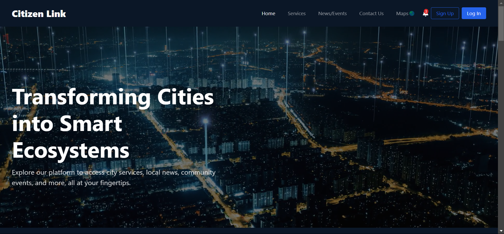
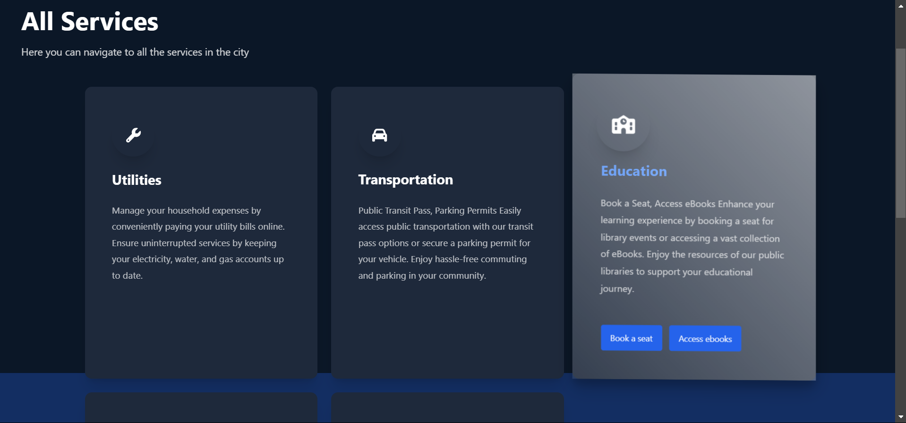
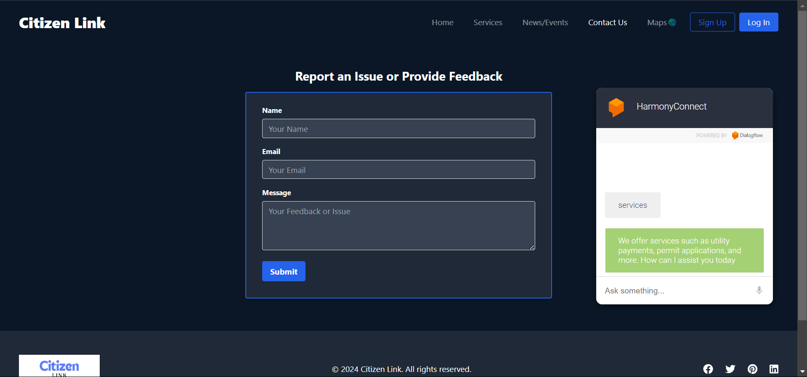
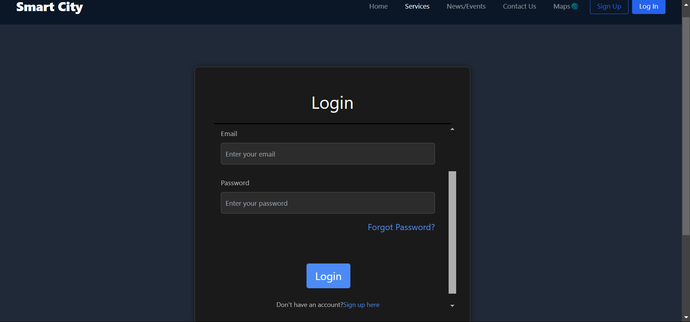
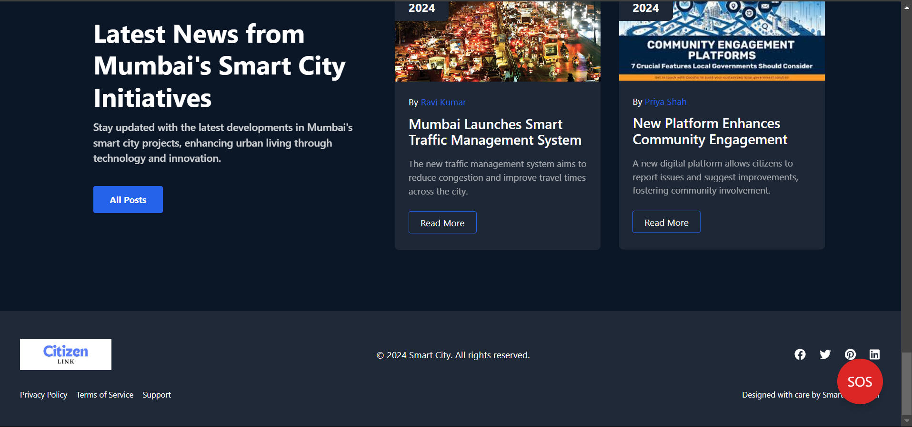

---

# Smart City Platform

This project is a front-end implementation of a Smart City platform built using HTML, CSS, Bootstrap, and JavaScript. The platform is designed to enhance citizen engagement by providing convenient access to a wide range of city services, local news, community events, issue reporting and tracking, emergency alerts, and an interactive map. The platform also includes visually appealing animations and modal-based user interactions.

## Features

- **Services Section**: A detailed grid view of city services, including utilities, transportation, education, health, and waste management.
- **Interactive UI**: Hover effects, responsive design, and animations to improve user experience.
- **Footer Section**: Includes links to social media, privacy policies, terms of service, and a credits section.
- **Custom Animations**: Modern animations and transitions for buttons and modals to enhance the visual experience.
- **Dark Mode Support**: The platform supports dark mode to cater to different user preferences.

## Technologies Used

- **HTML5**: For structuring the web pages.
- **CSS3**: For styling, including Flexbox and Grid for layout design.
- **Bootstrap**: For a responsive grid system and pre-designed components.
- **JavaScript**: For functionality, including modal interactions and dynamic content loading.
- **Font Awesome**: For icons used in the services section.


## Future Enhancements

- **Back-End Integration**: Connect the platform to a back-end server for processing service requests and user data.
- **Interactive Map**: Add a static map with dynamic arrows pointing to event or news locations across the city.
- **Push Notifications**: Real-time emergency alerts for citizens.
- **Enhanced Responsiveness**: Further refine the platform for mobile devices.

## Contributing

Contributions are welcome! If you'd like to make improvements or report issues, feel free to fork this repository and submit a pull request.

## License

This project is licensed under the MIT License - see the [LICENSE](LICENSE) file for details.

---

## Screenshots

### 1. Homepage



_Description_: This is the homepage of the Smart City platform, showcasing a clean and modern interface with a navigation bar and featured sections. It displays alert messages, SOS button, and various features that the website provides.
---

### 2. Services Section



_Description_: The Services section offers a categorized view of city services, such as Utilities, Transportation, and Health.
---

### 3. News and Events


_Description_: The News & Events section provides a combined view of the latest updates and upcoming events. Users can access news articles on the left and event details on the right, all within a single page for easy navigation and quick access to information.

---

### 4. Feedback and chatbot feature



_Description_: The Feedback page includes a built-in chatbot to assist users with navigating the website and answering queries. Alongside the feedback form, the chatbot provides real-time help and enhances user experience by offering quick responses to common questions about the platform.

---

### 5. LoginPage



_Description_: This is the login page
---

### 6. Footer Section



_Description_: The footer includes important links such as social media handles, privacy policy, terms of service, and credits. The design is minimalist, ensuring focus on the main content.

---

## How to Use

1. Clone this repository to your local machine:
    ```bash
    git clone https://github.com/your-username/smart-city-platform.git
    ```

2. Navigate to the project folder:
    ```bash
    cd smart-city-platform
    ```

3. Open the `index.html` file in your browser to view the platform.

---

